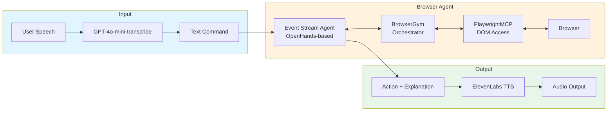

# Voice - Voice Browser Agent

## Setup

### Prerequisites

- Python 3.11 or higher
- pip (Python package manager)
- macOS/Linux system (for pyaudio compatibility)

### Step 1: Create Virtual Environment

```bash
# Navigate to project directory
cd voice_web_agent

# Create virtual environment
python3 -m venv venv

# Activate virtual environment
# On macOS/Linux:
source venv/bin/activate
# On Windows:
# venv\Scripts\activate
```

### Step 2: Install System Dependencies (macOS)

For PyAudio to work on macOS, you may need to install PortAudio:

```bash
# Using Homebrew
brew install portaudio
```

### Step 3: Install Python Dependencies

```bash
# Make sure virtual environment is activated
pip install --upgrade pip
pip install -r requirements.txt
```

### Step 4: Set Up Environment Variables

Create a `.env` file in the project root directory:

```bash
# Create .env file
touch .env
```

Add the following to `.env`:

```
OPENAI_API_KEY=your_openai_api_key_here
ELEVENLABS_API_KEY=your_elevenlabs_api_key_here
ELEVENLABS_VOICE_ID=nPczCjzI2devNBz1zQrb  # Optional, defaults to this value
```

Replace `your_openai_api_key_here` and `your_elevenlabs_api_key_here` with your actual API keys.

### Step 5: Verify Installation

```bash
# Run the application
python run.py
```

The application will prompt you for API keys if they're not found in the `.env` file.

### Troubleshooting

- **PyAudio installation issues**: On macOS, ensure PortAudio is installed via Homebrew. On Linux, you may need `portaudio19-dev` package.
- **Microphone not detected**: You can specify a microphone index as a command-line argument: `python run.py 0` (where 0 is the microphone index)

# Agent Architecture Analysis

## Overview

The agent consists of three main components: speech-to-text, a browser agent, and text-to-speech.

---

## 1. Speech-to-Text

- **Model**: GPT-4o-mini-transcribe (OpenAI API)
- **Rationale**: Best accuracy among tested options; familiarity with OpenAI API
- **Input Mode**: Push-to-talk
  - Prevents race conditions
  - Allows user speech and agent speech to run in parallel with browser actions

---

## 2. Browser Agent

### Browser Layer
- **Tool**: PlaywrightMCP
- **Rationale**: Returns DOM directly, avoiding latency from screenshot-based approaches

### Orchestration
- **Framework**: BrowserGym with PlaywrightMCP
- **Rationale**: Enables future evaluation testing via Browser Company Evaluation System

### Agent Architecture
- **Design**: Custom agent based on Event Stream architecture (OpenHands paper)
- **Rationale**:
  - Browser environments are highly variable; planning architectures are less effective
  - OpenHands-based agents perform best on SWE-Bench Verified
  - Adapted this architecture for browser-specific tasks

---

## 3. Text-to-Speech

- **API**: ElevenLabs (default voice)
- **Execution**: Runs in parallel with browser agent actions
- **Behavior**:
  - Each action is paired with an explanation
  - Explanations are skipped if speech is still playing
  - Actions are sequential (for accuracy), so explanations naturally compound

---

## Architecture Diagram



